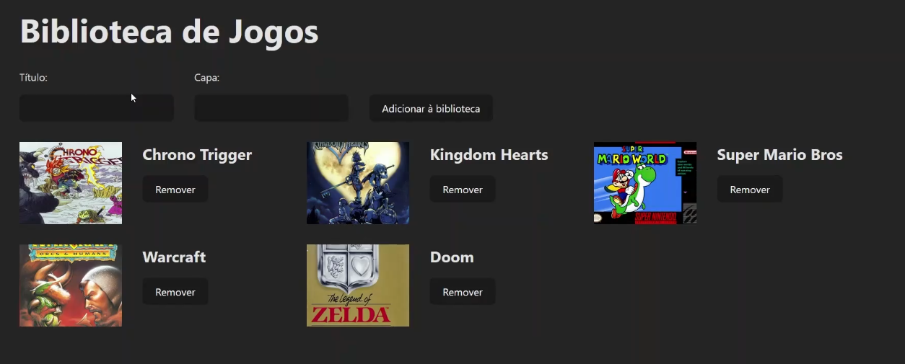

# Biblioteca de Jogos

Biblioteca de Jogos é um aplicativo web desenvolvido com React que permite gerenciar uma coleção de jogos, persistindo os dados no local storage do navegador.



## Funcionalidades

- 📚 Adicionar novos jogos à coleção
- 📝 Editar informações dos jogos existentes
- 🗑️ Remover jogos da coleção
- 💾 Persistir dados no local storage para manter a coleção salva entre sessões

## Tecnologias Utilizadas

- React
- Vite
- CSS Modules

## Como Executar o Projeto

1. Clone o repositório:

    ```bash
    git clone https://github.com/mdanieldantas/biblioteca-de-jogos.git
    cd biblioteca-de-jogos
    ```

2. Instale as dependências:

    ```bash
    npm install
    ```

3. Execute o projeto:

    ```bash
    npm run dev
    ```

4. Abra http://localhost:3000 no seu navegador para ver a aplicação em execução.

## Aprendizados

Este projeto foi uma excelente oportunidade para:

- 📚 Aprender e praticar React com Vite
- 🗃️ Implementar persistência de dados no local storage
- 🎨 Criar uma interface de usuário intuitiva e responsiva

## Contribuições

Contribuições são bem-vindas! Sinta-se à vontade para abrir uma issue ou enviar um pull request.

## Licença

Este projeto está sob a licença MIT. Veja o arquivo LICENSE para mais detalhes.

## Contato

**M Daniel Dantas**

- **GitHub:** mdanieldantas
- **LinkedIn:** mdanieldantas
- **Portfólio:** Portfólio de Daniel Dantas
- **Email:** contatomarcosdgomes@gmail.com
- **Link do Projeto:** biblioteca-de-jogos
- **Currículo:** Baixar Currículo
